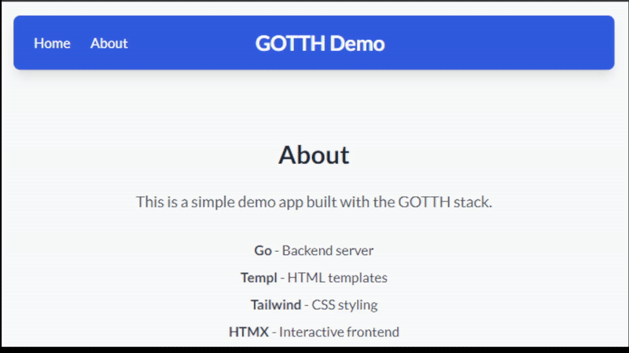

# 🚀 GOTH Stack

[](https://golang.org/doc/go1.23)
[](https://htmx.org)
[](https://tailwindcss.com)
[](https://templ.guide)

A modern, fully configured starter template for building fast, type-safe web applications using Go, HTMX, Tailwind CSS, Alpine.js, and Templ. This stack provides an incredible developer experience with type safety from your database all the way to your HTML.



## ✨ Features

- **📜 Type-Safe Templates**: Using [Templ](https://templ.guide) for compile-time checked templates
- **🔥 Hot Reload**: Using [Air](https://github.com/cosmtrek/air) for instant feedback during development
- **🎨 HTMX + Tailwind**: [Modern, interactive UIs](https://htmx.org) without complex client-side JavaScript
- **🛠️ Modern JS Utilities**: [Alpine.js](https://alpinejs.dev) for lightweight interactivity
- **📱 Responsive Design**: [Mobile-first approach](https://tailwindcss.com) with Tailwind CSS

## 🤔 Prerequisites

Before you begin, ensure you have the following tools installed:

- **Go 1.23+**: [Download Go](https://golang.org/dl/)
- **Node.js 18+**: [Download Node.js](https://nodejs.org/)


## 🛠️ Installation & Setup

### 1. Clone and Setup Dependencies

```bash
# Clone the repository
git clone https://github.com/Johandielangman/gotth
cd gotth

# Install Go dependencies
go mod download

# Install Node.js dependencies (for Tailwind CSS)
npm install
```

### 2. Install Development Tools

#### Install Templ (Template Generator)
```bash
go install github.com/a-h/templ/cmd/templ@latest
```
see 📚 [Templ Documentation](https://templ.guide)

#### Install Air (Hot Reload)
```bash
go install github.com/cosmtrek/air@latest
```
see 📚 [Air Documentation](https://github.com/cosmtrek/air)

#### Optional: Pre-commit Hooks
If you want to have pre-commits for code quality:

```bash
pip install pre-commit
pre-commit install --install-hooks
```

#### Optional: Make

If you want to use the `make` command for building and running tasks, ensure you have `make` installed. Most Unix-like systems have it pre-installed. If not, you can install it via your package manager. See [make](https://www.gnu.org/software/make/)

### 3. Environment Configuration

Create a `.env` file in the root directory with the following variables:

```bash
APP_ENV=LOCAL
APP_PORT=8080
TEMPL_PROXY_PORT=8081
```

> **Note**: The `.env` file is already included in this repository. You can modify the values as needed for your environment.

### 4. Build and Run

```bash
# Generate templates and build CSS
make build

# Start development server with hot reload
make dev

# Or run individual commands:
# - Generate templates: make templ
# - Build locally: make build-local
# - View logs: make tail
```

## 🚀 Getting Started

## 📁 Project Structure

```
gotth/
├── 📦 bin/                     # Compiled binaries
│   ├── build-errors.log        # Build error logs
│   └── main                    # Main executable
├── 🚀 cmd/                     # Application entry points
│   └── main/
│       └── main.go             # Main application entry
├── 🔧 internal/                # Private application code
│   ├── embed.go                # Static file embedding
│   ├── 🧩 components/          # Reusable UI components
│   │   ├── counter.templ       # Counter component template
│   │   └── counter_templ.go    # Generated Go code
│   ├── 🔐 nonce/               # Security nonce utilities
│   │   └── nonce.go            # CSP nonce generation
│   ├── 🌐 server/              # HTTP server configuration
│   │   ├── app.go              # Main app setup
│   │   ├── config.go           # Configuration management
│   │   ├── middleware.go       # HTTP middleware
│   │   └── routes.go           # Route definitions
│   ├── 📦 static/              # Static assets
│   │   ├── css/                # Stylesheets
│   │   │   ├── style.css       # Custom styles
│   │   │   └── tailwind.css    # Generated Tailwind CSS
│   │   ├── images/             # Image assets
│   │   │   └── favicon.ico     # Site favicon
│   │   └── script/             # JavaScript files
│   │       ├── htmx.min.js     # HTMX library
│   │       └── response-targets.js # HTMX extensions
│   └── 📄 views/               # Page templates
│       ├── layout.templ        # Base layout template
│       ├── layout_templ.go     # Generated layout code
│       ├── views.go            # View utilities
│       ├── about/              # About page
│       │   ├── about.templ     # About template
│       │   ├── about_templ.go  # Generated code
│       │   └── handler.go      # About page handler
│       └── home/               # Home page
│           ├── home.templ      # Home template
│           ├── home_templ.go   # Generated code
│           └── handler.go      # Home page handler
├── 📋 logs/                    # Application logs
│   └── app.log                 # Structured JSON logs
├── 🛠️ tmp/                     # Temporary files (Air hot reload)
│   └── main                    # Development binary
├── 📄 go.mod                   # Go module definition
├── 📄 go.sum                   # Go module checksums
├── 📄 package.json             # Node.js dependencies
├── 📄 tailwind.config.js       # Tailwind CSS configuration
├── 📄 Makefile                 # Build automation
└── 📄 README.md                # Project documentation
```

### 🏗️ Architecture Patterns

#### **Go Standard Project Layout**
This project follows the [Go Standard Project Layout](https://github.com/golang-standards/project-layout):

- **`cmd/`**: Main applications for this project
- **`internal/`**: Private application and library code
- **`bin/`**: Compiled application binaries

#### **Template Organization**
- **`.templ` files**: Source templates written in [Templ syntax](https://templ.guide)
- **`_templ.go` files**: Generated Go code (auto-generated, don't edit -- also ignored by git)
- Templates are organized by feature/page in subdirectories

#### **Static Asset Management**
- **CSS**: Tailwind CSS compiled from source
- **JavaScript**: HTMX for dynamic interactions
- **Images**: Favicon and other static assets
- All static files are embedded into the binary using Go's `embed` package

## 🔧 Development Workflow

### Template Development
1. Edit `.templ` files in your preferred editor
2. Run `make templ` to start the template watcher
3. Templates auto-regenerate on save
4. Browser auto-refreshes via proxy

### Styling with Tailwind
1. Use Tailwind classes directly in templates
2. Add custom styles to `internal/static/css/style.css`
3. Run `npm run build` to compile CSS
4. Styles are automatically included in the build

### Making Changes
1. **Backend**: Edit Go files in `internal/`
2. **Frontend**: Edit `.templ` files and CSS
3. **Routes**: Update `internal/server/routes.go`
4. **Static Assets**: Add to `internal/static/`

## 🎯 Useful Commands

| Command | Description |
|---------|-------------|
| `make dev` | Start development server with hot reload |
| `make build` | Build production binary |
| `make build-local` | Build local development binary |
| `make templ` | Start template watcher with proxy |
| `make tail` | View formatted application logs |
| `make vtail` | View raw JSON logs with color |
| `npm run build` | Compile Tailwind CSS |
| `templ generate` | Generate Go code from templates |


## 📚 Additional Resources

- **[Go Documentation](https://golang.org/doc/)**
- **[Templ Guide](https://templ.guide)**
- **[HTMX Documentation](https://htmx.org/docs/)**
- **[Tailwind CSS Documentation](https://tailwindcss.com/docs)**
- **[Chi Router Documentation](https://github.com/go-chi/chi)**
- **[Air Configuration](https://github.com/cosmtrek/air#config-file)**

---
Made with ❤️ by Johandielangman
